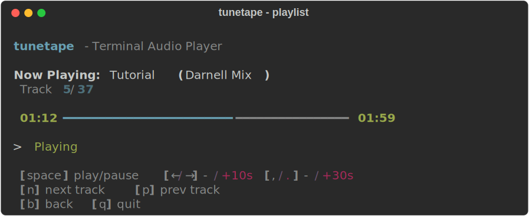
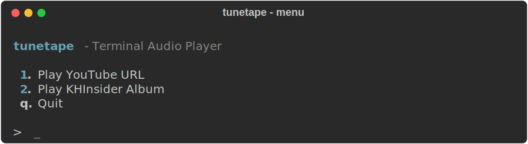
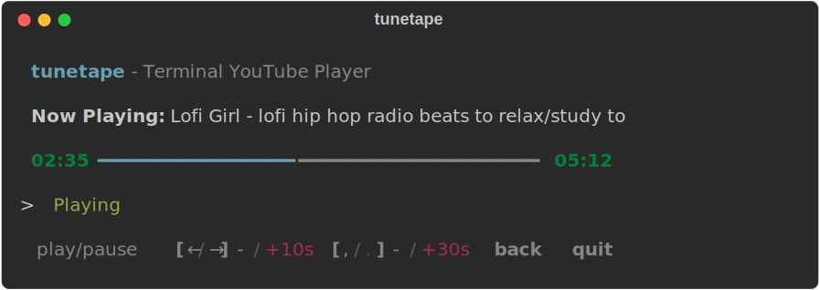
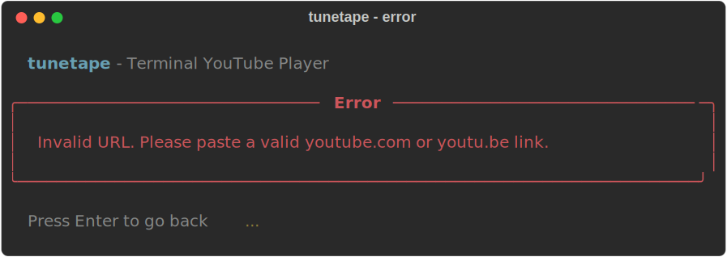

<p align="center">
  
</p>

<p align="center">
  
  
  
  
</p>

<h1 align="center">tunetape</h1>

<p align="center">
  <b>Stream audio straight from your terminal.</b><br>
  <sub>YouTube. Video game soundtracks. No browser. No distractions. Just music.</sub>
</p>

<br>

<p align="center">
  
</p>

---

## How it works

```
tunetape → pick a source → paste a URL → music plays in your terminal
```

tunetape plays audio through **mpv** (no video) with a clean TUI and keyboard controls — all without leaving the terminal.

**Two sources:**
- **YouTube** — paste any YouTube URL. Audio extracted via **yt-dlp**.
- **KHInsider** — paste a [downloads.khinsider.com](https://downloads.khinsider.com) album URL. Full playlist with next/prev track controls.

---

## Install

One command. Installs everything automatically (Python, mpv, yt-dlp):

```bash
curl -fsSL https://raw.githubusercontent.com/oauramos/tunetape/main/install.sh | bash
```

That's it. Now run:

```bash
tunetape
```

<details>
<summary><b>Manual install</b></summary>

<br>

If you already have the dependencies:

```bash
brew install mpv yt-dlp
git clone https://github.com/oauramos/tunetape.git
cd tunetape
python3 -m venv .venv && source .venv/bin/activate
pip install .
```

> **Note:** `yt-dlp` is only required for YouTube. KHInsider works with just `mpv`.

</details>

<details>
<summary><b>Uninstall</b></summary>

<br>

```bash
rm -rf ~/.tunetape && sudo rm /usr/local/bin/tunetape
```

</details>

---

## Screens

### Main Menu

<p align="center">
  
</p>

### YouTube Player

<p align="center">
  
</p>

### KHInsider Playlist

<p align="center">
  
</p>

### Error Handling

<p align="center">
  
</p>

---

## Controls

### General

| Key | Action |
|:---:|--------|
| `space` | Play / Pause |
| `-->` | Seek forward 10s |
| `<--` | Seek backward 10s |
| `.` | Seek forward 30s |
| `,` | Seek backward 30s |
| `b` | Back to menu |
| `q` | Quit |

### Playlist Mode (KHInsider)

| Key | Action |
|:---:|--------|
| `n` | Next track |
| `p` | Previous track |

Tracks auto-advance when they finish.

---

## Built with

- [mpv](https://mpv.io/) — lightweight media player
- [yt-dlp](https://github.com/yt-dlp/yt-dlp) — YouTube audio extraction
- [rich](https://github.com/Textualize/rich) — terminal UI rendering

---

## Requirements

- macOS (uses Unix sockets + termios)
- Python 3.9+
- Homebrew (auto-installed if missing)

---

<p align="center">
  <sub>Made for terminal lovers who just want to listen.</sub>
</p>
