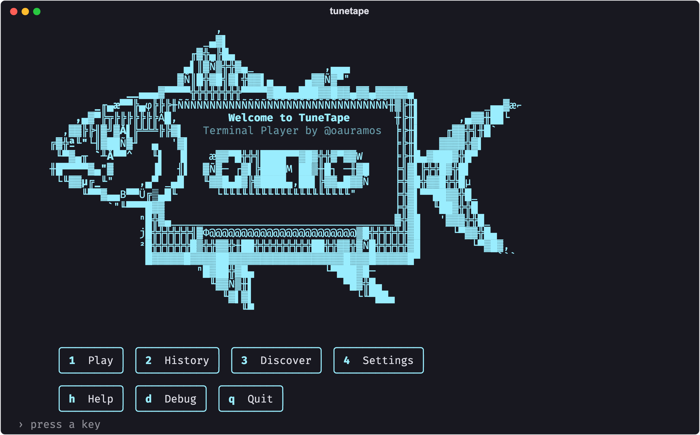
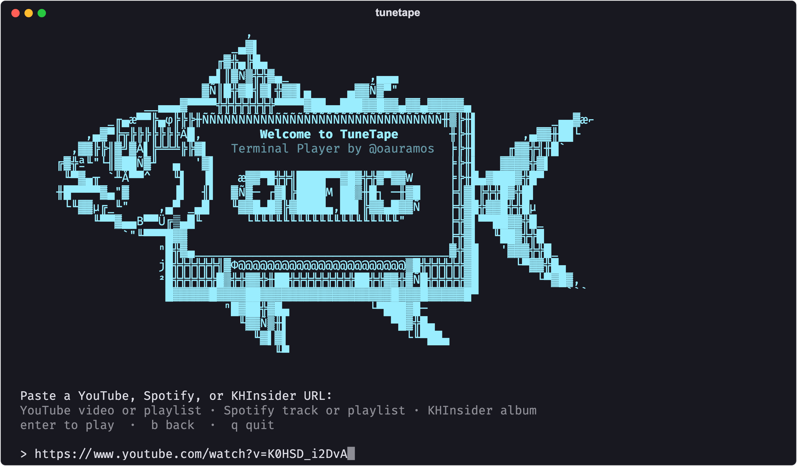
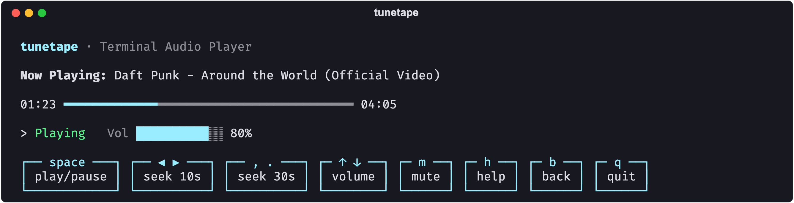
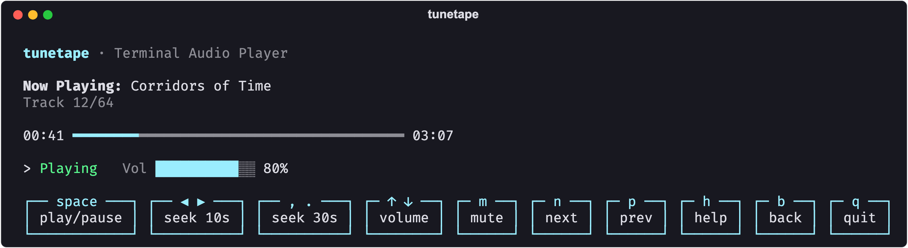
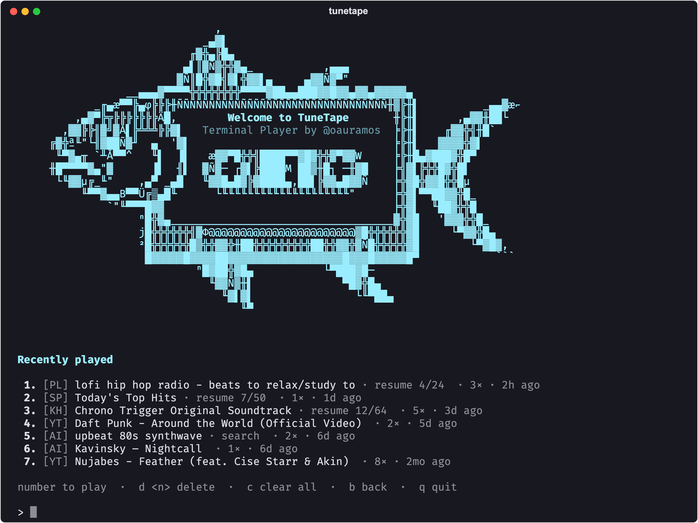
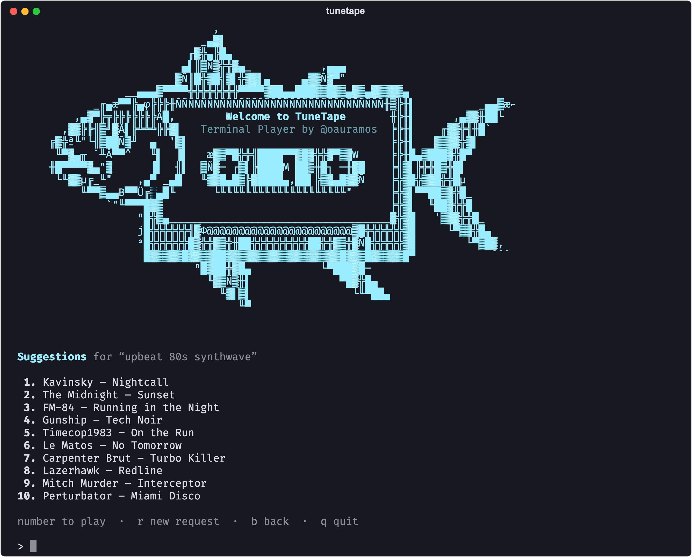
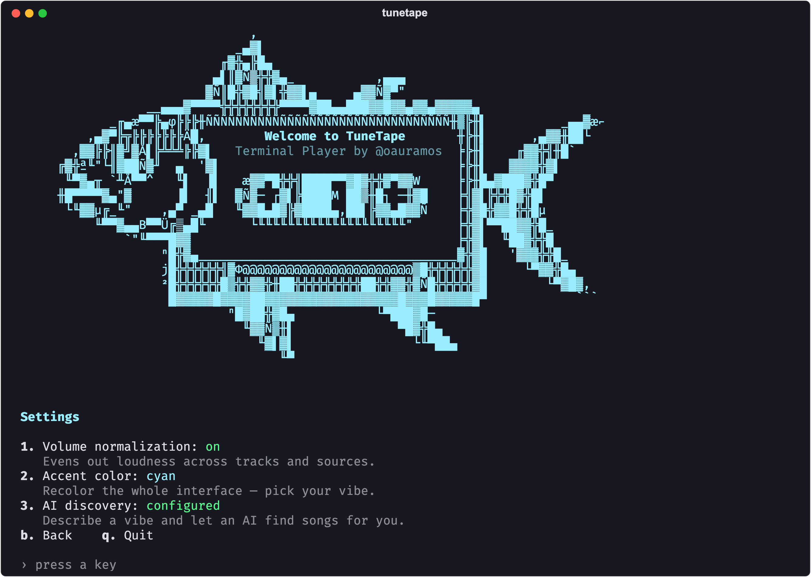

<p align="center">
  
</p>

<h1 align="center">tunetape</h1>

<p align="center">
  <b>Stream music from YouTube, Spotify and KHInsider, right inside your terminal.</b><br>
  <sub>Paste a link. Press Enter. Listen. No browser, no tabs, no ads.</sub>
</p>

<p align="center">
  <a href="https://github.com/oauramos/tunetape/actions/workflows/ci.yml"></a>
  
  
  <a href="https://github.com/oauramos/tunetape/releases"></a>
  <a href="LICENSE"></a>
</p>

<p align="center">
  <a href="#install">Install</a> ·
  <a href="#how-it-works">How it works</a> ·
  <a href="#screens">Screens</a> ·
  <a href="#keys-you-will-actually-use">Keys</a> ·
  <a href="https://github.com/oauramos/tunetape/wiki">Wiki</a>
</p>

<br>

<p align="center">
  
</p>

<br>

## What is tunetape?

tunetape is a small, keyboard-driven audio player that lives in your terminal. It hands the stream to [mpv](https://mpv.io/) (audio only) and wraps it in a clean text UI with real player controls. Nothing is downloaded or stored; it just plays.

- **Play from three sources.** YouTube videos and playlists, Spotify tracks and playlists, and [KHInsider](https://downloads.khinsider.com) video game soundtracks. Paste any link and the source is detected for you.
- **A real player.** Play/pause, seek, a volume meter, mute, next/previous track, and auto-advance through playlists.
- **Recently played.** Everything you play is remembered, and playlists resume at the track you left off.
- **Discover with AI.** Describe a vibe ("calm piano for focus") and get a list of real songs to play. Bring your own API key; the feature stays off until you add one.
- **Sounds even.** Optional loudness normalization keeps volume consistent across sources, and your last volume is remembered.
- **Runs everywhere.** macOS, Linux and Windows.

## Install

You need two tools on your machine, [mpv](https://mpv.io/) and [yt-dlp](https://github.com/yt-dlp/yt-dlp), plus tunetape itself. Pick your OS:

### macOS

One command via [Homebrew](https://brew.sh). It brings in Python, mpv and yt-dlp for you:

```bash
brew install oauramos/tunetape/tunetape
```

### Windows

```powershell
winget install shinchiro.mpv
winget install yt-dlp.yt-dlp
pip install git+https://github.com/oauramos/tunetape.git
```

### Linux

```bash
sudo apt install mpv yt-dlp        # or your distro's package manager
pip install git+https://github.com/oauramos/tunetape.git
```

### Run it

```bash
tunetape
```

That's it. Press **1**, paste a link, and press Enter.

> Want another way in? The install script, manual install, `uv`/`pipx`, upgrading and uninstalling are all covered in the wiki: **[Installation](https://github.com/oauramos/tunetape/wiki/Installation)**.

## How it works

### 1. Paste a link

Press **1** on the main menu and paste a YouTube, Spotify or KHInsider URL. tunetape figures out which source it is.

<p align="center">
  
</p>

### 2. It plays

The stream opens in mpv and you get a player with a progress bar, volume meter and one-key controls.

<p align="center">
  
</p>

### 3. Playlists just work

Spotify playlists, YouTube playlists and KHInsider albums show the track position and add **n** / **p** for next and previous. Tracks advance on their own.

<p align="center">
  
</p>

## Screens

### Recently played

Jump back into anything you have played. Playlists and albums resume where you stopped.

<p align="center">
  
</p>

### Discover (AI)

Type what you feel like hearing and pick a song from the suggestions. Each one streams from YouTube.

<p align="center">
  
</p>

### Settings

Toggle loudness normalization, pick an accent color for the whole interface, and set up AI discovery.

<p align="center">
  
</p>

## Keys you will actually use

| Key | Action |
|:---:|--------|
| `space` | Play / pause |
| `←` `→` | Seek 10s |
| `↑` `↓` | Volume |
| `n` `p` | Next / previous track |
| `m` | Mute |
| `h` | Toggle the full help overlay |
| `b` | Back |
| `q` | Quit |

The complete key reference for every screen is in the wiki: **[Usage and Controls](https://github.com/oauramos/tunetape/wiki/Usage-and-Controls)**.

## Learn more

The **[wiki](https://github.com/oauramos/tunetape/wiki)** has the details this page leaves out:

- [Installation](https://github.com/oauramos/tunetape/wiki/Installation): every install method, upgrading, uninstalling
- [Usage and Controls](https://github.com/oauramos/tunetape/wiki/Usage-and-Controls): each screen and every key
- [Sources](https://github.com/oauramos/tunetape/wiki/Sources): what links work and how each source is streamed
- [AI Discovery](https://github.com/oauramos/tunetape/wiki/AI-Discovery): Anthropic, OpenAI-compatible endpoints and local models
- [Settings](https://github.com/oauramos/tunetape/wiki/Settings): normalization, accent colors, where your data lives
- [Troubleshooting](https://github.com/oauramos/tunetape/wiki/Troubleshooting): playback stalls, missing tools, the Debug screen
- [FAQ](https://github.com/oauramos/tunetape/wiki/FAQ)

## Built with

- [mpv](https://mpv.io/), the media player doing the actual playback
- [yt-dlp](https://github.com/yt-dlp/yt-dlp), which resolves YouTube streams
- [rich](https://github.com/Textualize/rich), which draws the terminal UI

## License

MIT. See [LICENSE](LICENSE).

## Disclaimer

**tunetape** does not store, host, download, or redistribute any content from YouTube, Spotify, KHInsider, or any other third-party service. It is a lightweight terminal-based streaming client that relies on publicly available tools ([mpv](https://mpv.io/), [yt-dlp](https://github.com/yt-dlp/yt-dlp)) to stream audio in real time. For Spotify, only public metadata (track names and artists) is read to locate the matching audio on YouTube; no Spotify audio is accessed.

All trademarks, service marks, and brand names (including YouTube, Spotify, and KHInsider) are the property of their respective owners. This project is not affiliated with, endorsed by, or sponsored by any of these services.

Users are solely responsible for how they use this tool. Please respect copyright laws and the terms of service of any platform you access through tunetape.

---

<p align="center">
  <sub>Made for terminal lovers who just want to listen.</sub>
</p>
