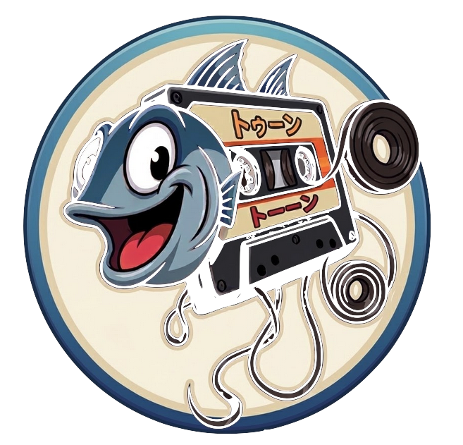
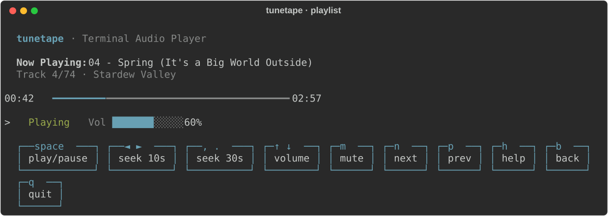
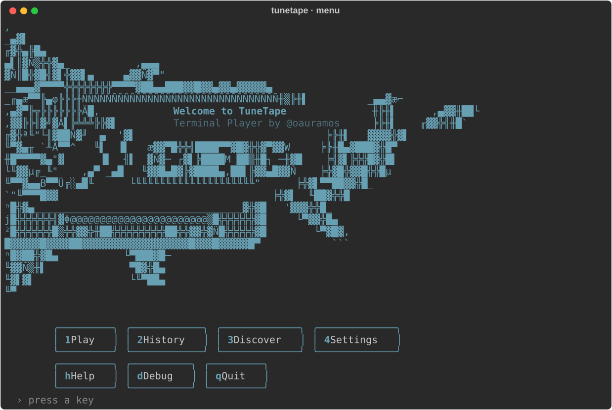
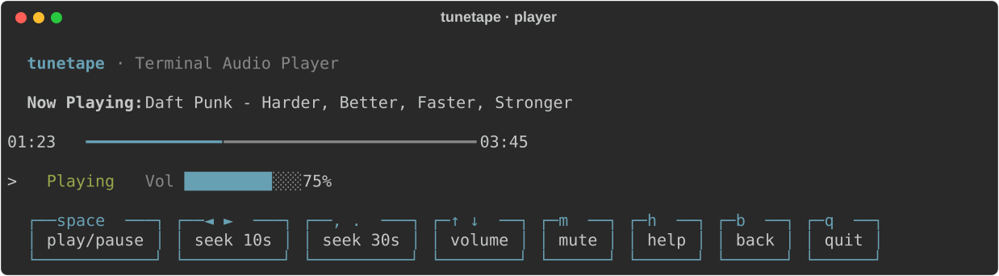
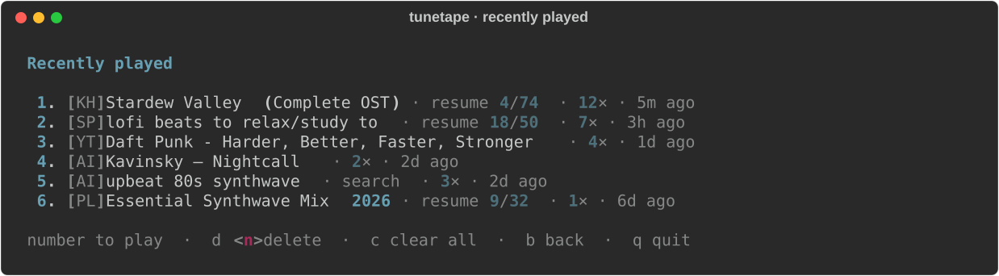
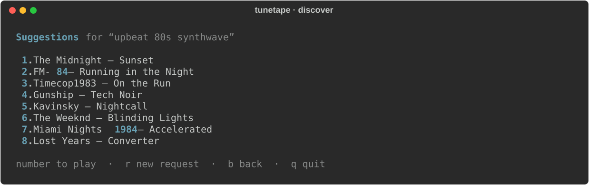
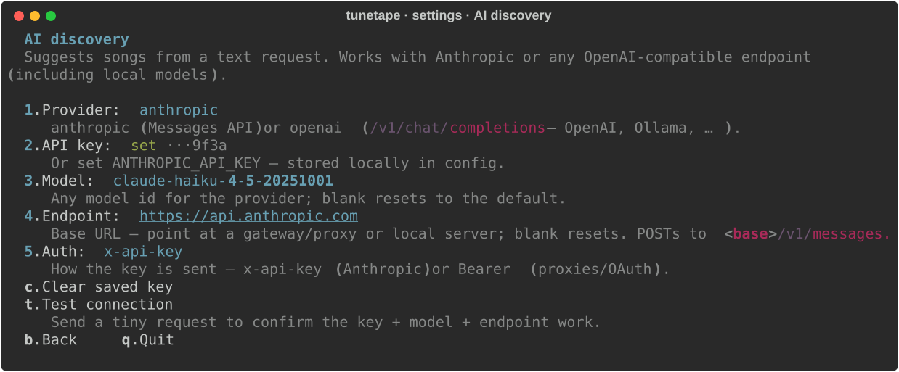
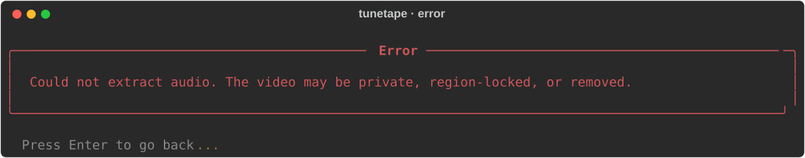

<p align="center">
  
</p>

<p align="center">
  
  
  
  
</p>

<h1 align="center">tunetape</h1>

<p align="center">
  <b>Stream audio straight from your terminal.</b><br>
  <sub>YouTube. Video game soundtracks. No browser. No distractions. Just music.</sub>
</p>

<br>

<p align="center">
  
</p>

---

## How it works

```
tunetape → paste a URL → music plays in your terminal
```

tunetape plays audio through **mpv** (no video) with a clean TUI and keyboard controls — all without leaving the terminal. Pick **Play**, paste any supported URL, and tunetape figures out the source.

**Three sources:**
- **YouTube** — paste any YouTube video **or playlist** URL. Audio extracted via **yt-dlp**.
- **Spotify** — paste a Spotify track **or playlist** URL. Spotify audio is DRM-locked, so tunetape reads the public track list (no login) and streams each song's match from YouTube.
- **KHInsider** — paste a [downloads.khinsider.com](https://downloads.khinsider.com) album URL. Full playlist with next/prev track controls.

**Discover (AI):** don't have a link in mind? Pick **Discover**, describe a vibe — *"upbeat 80s synthwave"*, *"calm piano for focus"* — and an AI suggests real songs you can pick from and play (streamed via YouTube). Bring your own [Anthropic API key](https://console.anthropic.com) (set it in **Settings → AI discovery**, or via the `ANTHROPIC_API_KEY` environment variable); the feature stays off until a key is provided.

**Remembers what you play:** every track, playlist, and album lands in a **Recently played** menu, so you can jump back in — playlists and albums even resume at the track you left off. Your last volume is remembered too, so playback picks up where you left it. Volume normalization (toggle in **Settings**) keeps loudness even across sources, powered by mpv's built-in FFmpeg filters.

---

## Install

One command via [Homebrew](https://brew.sh) — pulls in everything (Python, mpv, yt-dlp; FFmpeg rides along with mpv):

```bash
brew install oauramos/tunetape/tunetape
```

Then run:

```bash
tunetape
```

> `oauramos/tunetape` is a Homebrew *tap*; brew adds it automatically the first time.

<details>
<summary><b>Alternative: install script</b></summary>

<br>

Prefer not to tap? A script installs everything into `~/.tunetape`:

```bash
curl -fsSL https://raw.githubusercontent.com/oauramos/tunetape/main/install.sh | bash
```

</details>

<details>
<summary><b>Manual install</b></summary>

<br>

If you already have the dependencies:

```bash
brew install mpv yt-dlp
git clone https://github.com/oauramos/tunetape.git
cd tunetape
python3 -m venv .venv && source .venv/bin/activate
pip install .
```

> **Note:** `yt-dlp` is required for YouTube and Spotify (Spotify songs stream via YouTube). KHInsider works with just `mpv`.

</details>

<details>
<summary><b>Uninstall</b></summary>

<br>

Homebrew:

```bash
brew uninstall tunetape && brew untap oauramos/tunetape
```

Install script:

```bash
curl -fsSL https://raw.githubusercontent.com/oauramos/tunetape/main/install.sh | bash -s uninstall
```

> Your listening history in `~/.local/share/tunetape/` is left in place — delete that folder too for a full wipe.

</details>

---

## Screens

### Main Menu

<p align="center">
  
</p>

### Player

Paste any supported URL — the source is auto-detected.

<p align="center">
  
</p>

### Playlist Player

Spotify playlists, YouTube playlists, and KHInsider albums get next/prev track controls.

<p align="center">
  
</p>

### Recently Played

Everything you play is remembered — playlists and albums resume where you left off.

<p align="center">
  
</p>

### Discover (AI)

Describe a vibe and pick from AI-suggested songs — each plays via YouTube.

<p align="center">
  
</p>

### AI Discovery Settings

Bring your own key; point it at Anthropic or any compatible gateway.

<p align="center">
  
</p>

### Error Handling

<p align="center">
  
</p>

---

## Controls

### General

| Key | Action |
|:---:|--------|
| `space` | Play / Pause |
| `-->` | Seek forward 10s |
| `<--` | Seek backward 10s |
| `.` | Seek forward 30s |
| `,` | Seek backward 30s |
| `↑` / `+` | Volume up |
| `↓` / `-` | Volume down |
| `m` | Mute / unmute |
| `b` | Back to menu |
| `q` | Quit |

### Playlist Mode (Spotify · YouTube playlists · KHInsider)

| Key | Action |
|:---:|--------|
| `n` | Next track |
| `p` | Previous track |

Tracks auto-advance when they finish.

### Recently Played

Open it from the main menu to re-listen to anything you've played before (albums resume where you left off):

| Key | Action |
|:---:|--------|
| number | Play that entry |
| `d <n>` | Delete entry *n* |
| `c` | Clear all history |
| `b` | Back |
| `q` | Quit |

> AI entries replay two ways: a played song re-plays that track, while a saved request (`· search`) re-runs discovery for a fresh list.

### Discover (AI)

Pick **Discover** from the main menu, type a request, then choose a suggestion:

| Key | Action |
|:---:|--------|
| number | Play that suggestion |
| `r` | New request |
| `b` | Back |
| `q` | Quit |

> Requires an [Anthropic API key](https://console.anthropic.com) — set it in **Settings → AI discovery** or via `ANTHROPIC_API_KEY`. You can also point it at any Anthropic-compatible gateway (custom endpoint + x-api-key or Bearer auth) from the same screen.

---

## Built with

- [mpv](https://mpv.io/) — lightweight media player
- [yt-dlp](https://github.com/yt-dlp/yt-dlp) — YouTube audio extraction
- [rich](https://github.com/Textualize/rich) — terminal UI rendering

---

## Requirements

- macOS (uses Unix sockets + termios)
- Python 3.9+
- [Homebrew](https://brew.sh) (for the recommended install; the script installs it automatically if missing)

> Listening history and settings live in `~/.local/share/tunetape/` and persist across upgrades.

---

## Troubleshooting

**A track loads but the timer sits at 0:00.** YouTube periodically changes which
of its player clients hand out stream URLs that `mpv` can read. tunetape asks
`yt-dlp` for a client that works, but if YouTube shifts again you can point it at
a different one without waiting for a release:

```bash
TUNETAPE_YTDLP_CLIENT=tv_embedded tunetape
```

Any client list `yt-dlp` accepts for `youtube:player_client` works; entries are
tried in order. Keeping `yt-dlp` current helps too — `brew upgrade yt-dlp`.

Press `d` on the main menu to open **Debug / Logs**, which now shows what `mpv`
reported when a stream fails to open.

---

## License

This project is free to use, modify, and distribute. See [MIT License](LICENSE) for details.

---

## Disclaimer

**tunetape** does not store, host, download, or redistribute any content from YouTube, Spotify, KHInsider, or any other third-party service. It is a lightweight terminal-based streaming client that relies on publicly available tools ([mpv](https://mpv.io/), [yt-dlp](https://github.com/yt-dlp/yt-dlp)) to stream audio in real time. For Spotify, only public metadata (track names and artists) is read to locate the matching audio on YouTube; no Spotify audio is accessed.

All trademarks, service marks, and brand names (including YouTube, Spotify, and KHInsider) are the property of their respective owners. This project is not affiliated with, endorsed by, or sponsored by any of these services.

Users are solely responsible for how they use this tool. Please respect copyright laws and the terms of service of any platform you access through tunetape.

---

<p align="center">
  <sub>Made for terminal lovers who just want to listen.</sub>
</p>
